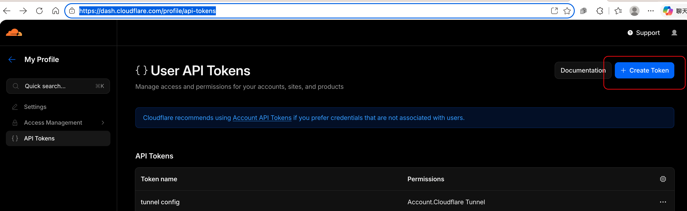
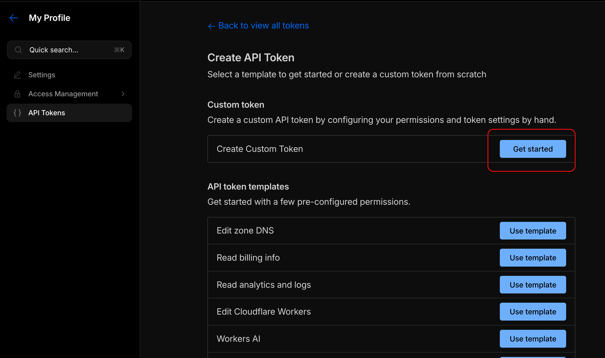
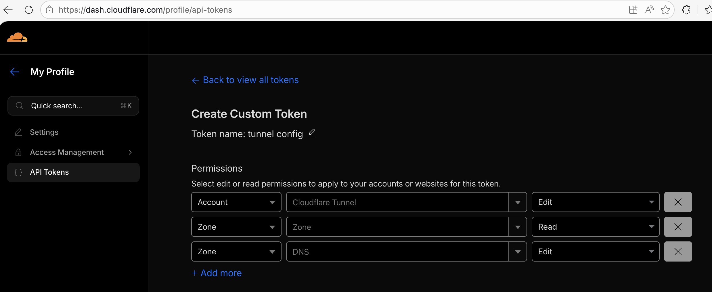
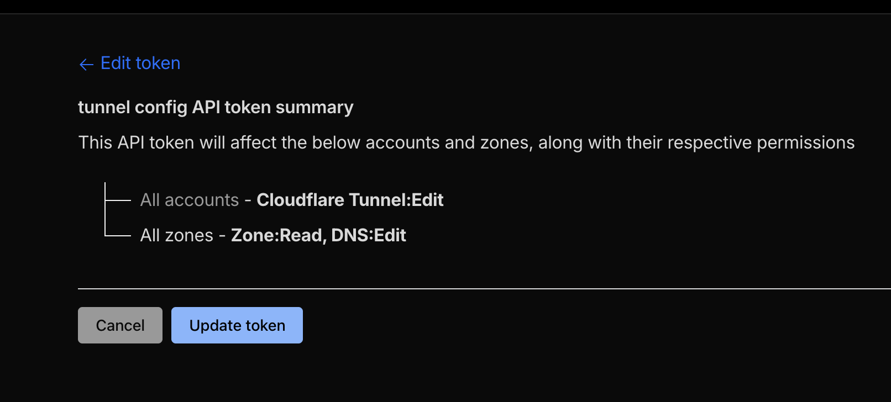

# Cloudflare Tunnel Tips

## Quick: Expose a Local Port for a Demo

Use `add-route.sh` to add a new public hostname to the `mymbpr` tunnel in one command:

```bash
# One-time: set your API token in ~/.zshrc (see screenshots below for how to create one)
export CLOUDFLARE_API_TOKEN=your_token_here

# Expose localhost:3000 at https://mymbpr-demo.wormhole.work
./add-route.sh mymbpr-demo 3000

# List current routes
./list-routes.sh

# Remove a route
./remove-route.sh mymbpr-demo
```

The scripts never hardcode account or tunnel IDs. They read everything from cloudflared's own files:

| What | Where it comes from |
|---|---|
| Tunnel name, Account ID, Tunnel ID | `~/.cloudflared/<tunnel-id>.json` (written by `cloudflared service install <token>`) |
| Domain | `.env` file alongside the scripts |
| API token | `CLOUDFLARE_API_TOKEN` env var (set in `~/.zshrc`) |

On a fresh machine, run the install command from the Cloudflare dashboard and copy the `.env` file — no IDs to look up.

### Creating the API Token

**Step 1** — Go to [dash.cloudflare.com/profile/api-tokens](https://dash.cloudflare.com/profile/api-tokens) and click **+ Create Token**.



**Step 2** — There is no pre-built template for Cloudflare Tunnel. Under "Custom token", click **Get started**.



**Step 3** — Name the token (e.g. `mytunnel-token`) and add three permissions:
- **Account → Cloudflare Tunnel → Edit**
- **Zone → Zone → Read**
- **Zone → DNS → Edit**

Zone:Read is needed to look up the Zone ID. DNS:Edit is needed to list and delete DNS CNAME records.



**Step 4** — Review the summary and click **Create Token**.



Copy the token value shown on the next screen — it is only displayed once.

The script reads the current remote config, appends the new route, pushes it back via the Cloudflare API, and creates the DNS CNAME. The running `cloudflared` daemon picks it up immediately — no restart needed.

### Why not the Cloudflare MCP for Claude Code?

The [Cloudflare MCP for Claude Code](https://developers.cloudflare.com/agent-setup/claude-code/) is focused on **developer platform products** — Workers, KV, R2, D1, Hyperdrive. It has no tools for Cloudflare Tunnel management. The only way to automate tunnel routes from Claude Code is to call the Cloudflare REST API directly, which is what `add-route.sh` does.

### Install as a Claude Code plugin

The repo is laid out as a Claude Code plugin (`.claude-plugin/plugin.json` + `skills/cf-publish/SKILL.md`) so any Claude Code session can publish a local port by saying things like "expose port 3000" or "give me a public URL for localhost:8080".

```bash
# One-time install (symlink the whole repo; `git pull` keeps it up to date)
ln -s "$(pwd)" ~/.claude/plugins/cf-publish

# Verify the plugin layout
ls ~/.claude/plugins/cf-publish/.claude-plugin/plugin.json
ls ~/.claude/plugins/cf-publish/skills/cf-publish/SKILL.md
```

Prerequisites still apply per-machine: `cloudflared` installed, tunnel created (see Fresh Laptop Setup below), and a `.env` file in this directory with `CLOUDFLARE_DOMAIN`, `CLOUDFLARE_API_TOKEN`, and `CLOUDFLARE_ACCOUNT_ID`.

To uninstall: `rm ~/.claude/plugins/cf-publish`.

---

## Fresh Laptop Setup

### 1. Install cloudflared

```bash
brew install cloudflared          # macOS
# or see https://pkg.cloudflare.com/ for other platforms
```

### 2. Clone this repo and configure `.env`

```bash
git clone https://github.com/changtimwu/cloudflare-tunnel-tips.git
cd cloudflare-tunnel-tips
cp .env.example .env
$EDITOR .env
```

`.env` must contain:

```bash
CLOUDFLARE_DOMAIN=wormhole.work                       # your zone
CLOUDFLARE_API_TOKEN=cfut_xxxxxxxxxxxxxxxxxxxxxxxx    # see "Creating the API Token" above
CLOUDFLARE_ACCOUNT_ID=15bfe332876061d9a548a4f3d6835657 # see note below
```

> **Why `CLOUDFLARE_ACCOUNT_ID` is required:** the API token created above has resource-scoped
> permissions (`Cloudflare Tunnel:Edit`, `Zone:Read`, `DNS:Edit`) but no `Account:Read`, so
> `GET /accounts` returns success with an empty list and the account ID must be supplied directly.
> Find it in **dash.cloudflare.com → Account Home** (right sidebar), or in any existing
> `~/.cloudflared/<tunnel-id>.json` under the `AccountTag` field.

### 3. Create the tunnel & install the connector

**Option A — fully CLI (recommended):**

```bash
sudo cloudflared service install "$(./get-tunnel-token.sh mylaptop)"
```

This one command:
1. Calls `GET /accounts/{id}/cfd_tunnel?name=mylaptop` — looks up the tunnel.
2. If not found, calls `POST /accounts/{id}/cfd_tunnel` to create it (remotely-managed, random secret).
3. Calls `GET /accounts/{id}/cfd_tunnel/{tunnel-id}/token` — fetches the install token (same value the dashboard shows).
4. `cloudflared service install <token>` writes `~/.cloudflared/<tunnel-id>.json`, generates `config.yml`, and registers cloudflared as a system service that starts on boot.

The tunnel is created in **remotely-managed** mode so the route scripts (`add-route.sh`, `list-routes.sh`, `remove-route.sh`) work against it directly via the API.

> Use `./test-tunnel-token.sh` first if you want to verify each API call independently — it walks
> through token verify → list accounts → list tunnels → fetch token, printing the outcome of
> each step.

**Option B — copy from the dashboard:**

Go to **[dash.cloudflare.com → Zero Trust → Networks → Tunnels](https://one.dash.cloudflare.com)** → **+ Add a tunnel** → **Cloudflared**, name the tunnel, and copy the one-line install command from the **Install connector** step:

```bash
sudo cloudflared service install eyJhIjoiMTViZmUz...
```

### 4. Verify the tunnel is running

```bash
cloudflared tunnel list
```

The tunnel status should show **HEALTHY** in the Zero Trust dashboard within a few seconds.

### 5. Publish a route

```bash
./add-route.sh demo 3000
# → https://demo.wormhole.work routes to localhost:3000
```

### Reconnecting an existing tunnel on a new machine

If a tunnel already exists (created from another machine) and you just need to run it here, Option A above works exactly the same — pass the existing tunnel name and `get-tunnel-token.sh` will find it (no creation) and emit its current install token. Or copy credentials manually:

```bash
scp old-machine:~/.cloudflared/*.json ~/.cloudflared/
sudo cloudflared service install
```

---

## Concepts

### Mental Model

```
Domain (wormhole.work)
└── Tunnel (mymbpr) — represents ONE physical machine
    ├── mymbpr-simple.wormhole.work → localhost:3000
    ├── mymbpr-ssh.wormhole.work    → localhost:22
    └── mymbpr-api.wormhole.work    → localhost:8080
```

**Domain** — `wormhole.work` lives in Cloudflare DNS. One domain can have many tunnels attached to it, each representing a different machine on a different intranet.

**Tunnel** — a persistent encrypted connection from one physical machine to Cloudflare's edge, maintained by the `cloudflared` daemon. The tunnel name (e.g. `mymbpr`) is just a label for the machine — it has nothing to do with subdomain names.

**Public Hostname (route)** — maps a subdomain to a local port on that machine. Add as many as you want per tunnel. Cloudflare automatically issues and renews HTTPS certificates for each one.

> Subdomains must be one level deep (e.g. `mymbpr-simple.wormhole.work`) to be covered by
> Cloudflare's free Universal SSL wildcard (`*.wormhole.work`). Third-level subdomains like
> `simple.mymbpr.wormhole.work` are not covered and will cause `ERR_SSL_VERSION_OR_CIPHER_MISMATCH`.

### What Each Piece Does

| Thing | Where it lives | What it does |
|---|---|---|
| `cloudflared` daemon | Your machine | Keeps the tunnel connection alive |
| Tunnel credential JSON | `~/.cloudflared/<tunnel-id>.json` | Authenticates your machine to Cloudflare |
| Public Hostname config | Cloudflare Zero Trust dashboard | Maps subdomain → local port |
| DNS CNAME record | Cloudflare DNS | Points the subdomain at the tunnel |

The dashboard config and DNS CNAME are created together when you add a public hostname — you don't manage them separately.

### Local config.yml vs Dashboard (Remote) Config

Cloudflare Tunnels support two ingress management modes:

**Locally-managed** — ingress rules live in `~/.cloudflared/config.yml`. Works when the tunnel has never been configured via the dashboard.

**Remotely-managed** — ingress rules are configured in the Zero Trust dashboard and pushed to `cloudflared` at runtime. The dashboard config overrides any local `ingress:` rules in config.yml.

Once a tunnel is remotely-managed, use the dashboard to add/remove routes. This is the better approach for a persistent machine with multiple apps — you can change routes without restarting `cloudflared`.

---

## Adding a New Route via Dashboard

1. Go to [Cloudflare Zero Trust dashboard](https://one.dash.cloudflare.com) → **Networks → Tunnels → mymbpr → Configure**
2. **Public Hostnames** tab → **Add a public hostname**
   - Subdomain: `mymbpr-demo`
   - Domain: `wormhole.work`
   - Service Type: `HTTP`
   - URL: `localhost:3000`
3. Save — Cloudflare creates the DNS CNAME and issues the HTTPS cert automatically. The running `cloudflared` picks up the new route immediately, no restart needed.

---

## Current Routes (mymbpr tunnel)

Tunnel ID: `3e3ddd46-93d1-4c68-bbaf-e04085c1bede`

| Subdomain | Local service |
|---|---|
| `mymbpr-simple.wormhole.work` | `http://localhost:3000` |
| `ssh.mymbpr.wormhole.work` | `ssh://localhost:22` |

---

## Useful Commands

```bash
# List all tunnels
cloudflared tunnel list

# Tunnel details and active connections
cloudflared tunnel info mymbpr

# Start the tunnel
cloudflared tunnel run mymbpr
```
